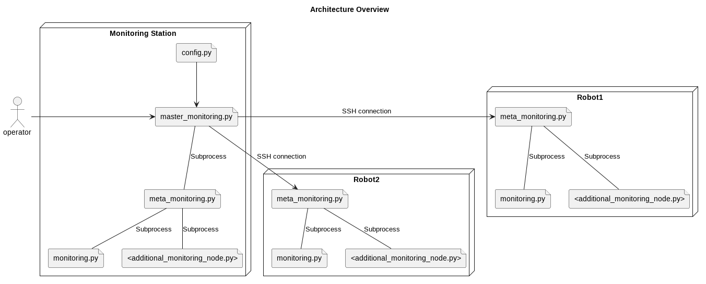

# Remote Monitoring

### Purpose
This repository was originaly created to monitor multiple robots all at once using different scripts for an experiment. Once the "master" file called `master_monitoring.py` is launched, a specific number of other files will alwo be triggered, starting the experiment. The master file use a config file as an input to monitor itself and a various number of robots. The connection between the monitoring station and the robot is provided by SSH protocol, allowing execution of command lines or downloading back the created database (at the end of the experiment). During the experiment, a database (`csv` format) is created by the monitoring script (create automaticaly a folder) at the specified path in the config file. Otherwise the script will try to create it in the package folder.

The overall architecture of the script follows like this:


Each robot has a "sub-master" node called `meta_monitoring.py` responsible for launching all the monitoring script within a device (robot or monitoring station). This architecture is up to down only with a partial or complete download of the database at the end of the experiment.


### Installation
The installation was tested on `Python 3.10.6` with the default libraries:
- `os`
- `subprocess`
- `threading`
- `sys`
- `paramiko`
- `colorama`
- `multiprocessing`
- `argparse`
- `psutil`
- `csv`
- `time`

For more information about the installed libraries, please check the `requirements.txt` file.

Installed libraries:
- `psutil` (Give measurement related to your computer)
- `paramiko` (SSH connection)
- `colorama` (Nice looking terminal output)
- `pyserial` (Allow the script to interface with serial interface, used for the GPS)

Strictly speaking, the monitoring station should have the whole package whereas the other rovers only the `monitoring.py` and `meta_monitoring.py` files. However, installing the package on the robot has no effect. 

### Usage
Before launching the `master_monitoring.py` make sure to enter every needed informations in the config file such has host, username and password for the SSH connection.

Once everything is configured, run the command:

```shell
$ python3 master_monitor.py
```

Note that you can have further documentation on each script by running:

```shell
$ python3 <name_of_the_script.py> -h
```
### MPROCS

To get an overview of the experiment, just run 
    
    ```shell
    $ mprocs --config ~/mesh_exp/remote_monitoring/mproc.yaml
    ```
use S to start a process, Q to stop it and R to restart it.


### Limitations
Currently it is not possible to change dynamicaly or remotely the monitoring scripts during runtime. The name of the script should be hard coded within the `meta_monitoring.py` file.

This package is experiment oriented, meaning the first purpose is to collect efficiently data, not do live monitoring. Live monitoring would probably change deeply the architecture of the package.

## Data Analysis

This is made of two main parts, the data treatment and the plot

### Data treatment

The data treatment is performed in four steps, all launched from the script called `global_processing.py`. It should be called on the root folder of every DDS

```shell
python3 global_processing.py <folder_path>
```

The program calls 4 classes:
- rename_column: Rename the column "TimeStamp" of the delay files, that should be "Timestamp"
- CSVFileMerger: Merges the three files of each run in one file that finishes by *_merged.csv, it also resamples the data at a 1 second rate in q *_resampled.csv
- SizeAverageVar: Compute the average and variance of the 5 runs for a message size, for a RMW
- RMWAverageVar: Compute the overall average and variance for all the runs for all the sizes of a DDS

If you want to compute the average of only certain runs you can run

```shell
python3 rmw_average_variance_select.py <folder_path> <list of sizes>
```
example

```shell
python3 rmw_average_variance_select.py /home/lchovet/mesh_exp/dataset/zenoh_clean KILO32 KILO64
```

You will get files named with the sizes at the root of the RMW folder

### Data plotting

`plot_all_rmw.py` is used to plot as many metrics as wanted, according to time for the three RMW. By default, it refers to the global average

Arguments:
- <Metrics> a list of metrics to display
- `--plot_variances` to plot the variances
- `--use_run` to plot the data for only one run and not the average
- `--run_size <SIZE>` to  indicate which message size to be diplayed
- `--run_number <int>` to indicate which number to run, make sure every RMW have a run of this value

Example:

```shell
python3 plot_all_rmw.py LONG_leo02 LAT_leo02 Delay_local Ping_target_local Bytes_Send_leo02 RAM_percent_leo02 --use_run --run_size KILO8 --run_number 3

```

`plot_overview.py` is used to plot specificaly the Px and Py, Reachability and Delay, giving the overview for a given run or the average using the same arguments as plot_all_rmw

`plot_overview_one.py` is the same as plot overview but only for one DDS, it takes an additionnal argument for the rmw

**Ploting the overview for Zenoh, for the 6th run of the size KIL1O6**

```shell
python3 plot_overview_one_rmw.py zenoh --use_run --run_size KILO16 --run_number 6
```

**Ploting the overview for Zenoh, for the average with variance**

```shell
python3 plot_overview_one_rmw.py zenoh --plot_variances
```
